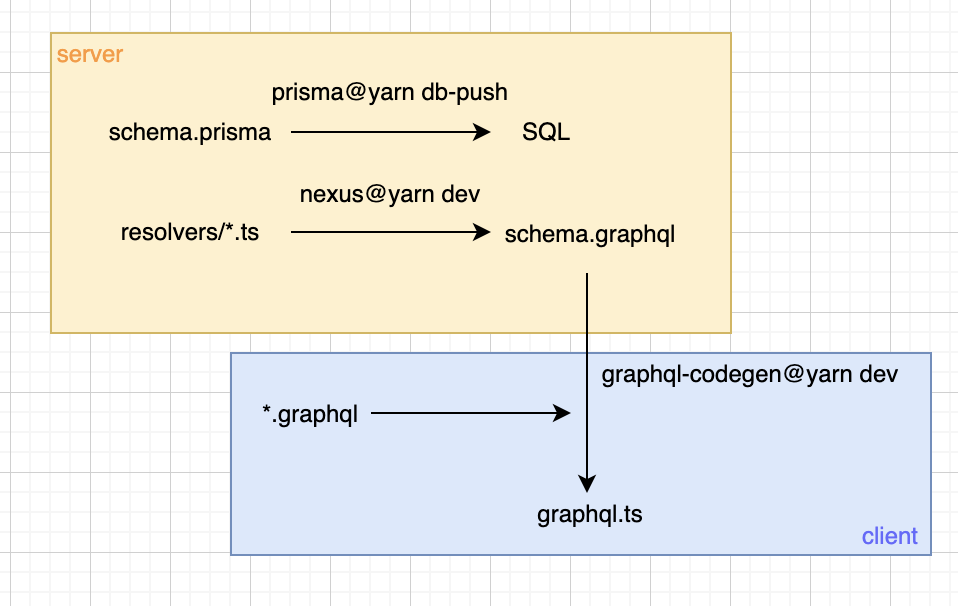

# gql-example-gomoku

## Setup

1. Install depenedencies

    ```
    yarn
    ```

2. Setup VSCode
   
  Search and install plugin `GraphQL` (graphql.vscode-graphql), and `Prisma` (prisma.prisma).

## Development

### Server

1. Generate database types
    ```
    yarn prisma generate
    ```

2. Migrate database (development)
    ```
    yarn db-push
    ```

3. Run server and restart on changes (development). Note that GraphQL types are generated on server start.
    ```
    yarn dev
    ```

### Client

1. Development.
   
   ```
   yarn dev
   ```

### Type Synchronization

#### Type Dependencies

To keep an end-to-end typed coding and running, we at least need to keep the following types in sync (ideally):

1. Source Types (The as-is data type in the DB)
2. Server GraphQL Types (The types defined on server-side)
3. Client GraphQL Types (The types defined on client-side)

The *Source Types* itself is inside the database, as defined in [schema.prisma](packages/server/prisma/schema.prisma).

The *Server GraphQL* Types describes the type of data provided by the server.

The *Client GraphQL* depends on the compatibility of *Server GraphQL*.

The relationship of the types and other code can be illustrated below:


#### Synchronization

+ Server
  + Use `prisma` to synchronize `schema.prisma` with databse by hand, no exception.
  + `schema.ts` generates the types and GraphQL SDL `schema.graphql` in `generated/` from `resolvers/` on server restart.
  
+ Client
  + Custom vite plugin `pluginGraphqlCodegen` watches changes in `schema.graphql` and `*.graphql` (clientside queries) and generates `graphql.tsx` in its `generated/` folder.


